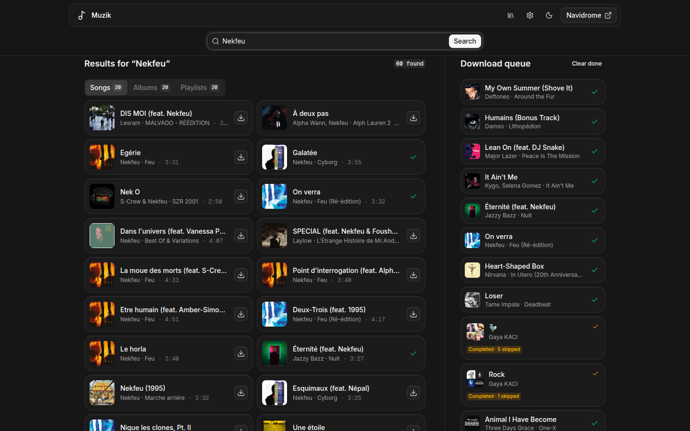
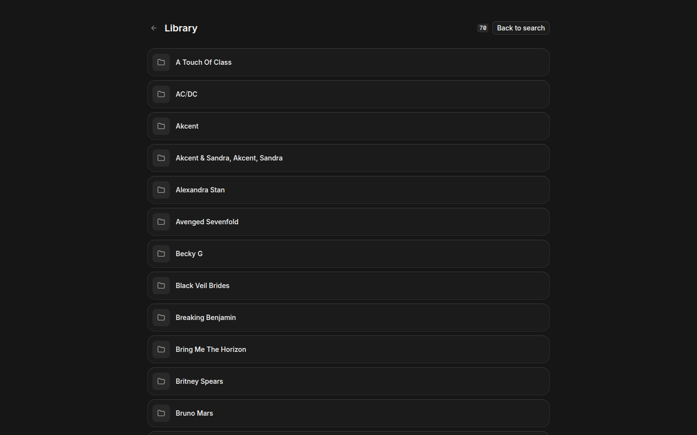

<p align="center">
  
</p>

<h1 align="center">Muzik</h1>

<p align="center">
   <strong>A YouTube Music search and download front end for your own music library.</strong><br>
   <em>Search or paste a link, queue the download, and the tracks land tagged on disk.</em>
</p>

Muzik writes into a directory you choose, in an `Artist/Album/Track` layout that Navidrome,
Jellyfin, Plex, or a plain file browser can read. It has no accounts and no database.

## Screenshots

### Search and download queue



### Library browser



## Features

- Asks where to store music on first run, then remembers it
- Search songs, albums, and playlists from YouTube Music, with live suggestions while typing
- Paste a link instead of searching: YouTube, YouTube Music, SoundCloud, or Bandcamp. A `watch?v=…&list=…` link offers both the single song and the full collection
- Expand an album or playlist to see its tracks and queue only the ones you want
- Follow an album or playlist and Muzik re-checks it on a schedule, downloading whatever was added since
- Serial download queue with live progress, speed, and time remaining, plus cancel and retry, persisted to disk and recovered after a restart
- Browse what has been downloaded, re-queue a track, or delete files once deleting is enabled
- Pick the audio format: m4a, opus, flac, or mp3
- One broad genre assigned per download from MusicBrainz tags, with album artist and album year normalized from the files themselves
- Optional synced lyrics written next to each track as `.lrc`
- Refuses to start a download when the disk is nearly full, instead of failing halfway through
- Duplicate protection through a yt-dlp download archive and a queue that refuses to add the same source twice
- Optional links straight into a Navidrome instance, and an optional scan trigger after each download
- Optional routing of all downloads through a VPN container
- Installable as a PWA, with `/` and `⌘K` shortcuts, light and dark themes, and a queue bar that follows you on mobile

## Tech stack

- Framework: Next.js 16 (App Router)
- UI: React 19, Tailwind CSS 4, [coss ui](https://coss.com/ui) components on Base UI, Lucide and morphicons
- Language: TypeScript
- Downloader: yt-dlp with ffmpeg
- Metadata: ytmusicapi for YouTube Music, yt-dlp for other sources, mutagen for tag rewriting, MusicBrainz for genre, lrclib.net for lyrics
- Testing: `node --test` for the TypeScript modules, `unittest` for the Python bridge

## Running with Docker

```bash
docker build -t muzik .
docker run -d --name muzik \
  -p 3020:3020 \
  -v /path/to/your/music:/music \
  -v muzik-data:/data \
  muzik
```

Or with Compose, after pointing the music volume in `compose.yaml` at your library:

```bash
docker compose up -d
```

The image bundles ffmpeg, yt-dlp, and the Python bridges. `/data` holds the queue, the
download archive, the MusicBrainz cache, and your chosen library path, so keep it on a
volume if you want any of that to survive a restart.

## First run

Muzik asks for a music folder the first time you open it and writes the answer to
`settings.json` in the data directory. In Docker the answer is `/music`, which is where
your library is mounted.

The folder is created if it does not exist, and it has to be an absolute path that the
Muzik process can write to. Since Muzik has no accounts, the setup screen only accepts a
folder while none is configured; changing it later means editing `settings.json` or
setting `MUZIK_MUSIC_DIR`. That variable also skips the screen entirely, which is what you
want for an automated deployment.

Muzik has no authentication. Bind it to a private interface or put it behind whatever
front end you already use for the rest of your services.

## Configuration

| Variable | Default | Purpose |
| --- | --- | --- |
| `MUZIK_MUSIC_DIR` | unset | Pins the library root and skips the first-run screen |
| `MUZIK_DEFAULT_MUSIC_DIR` | unset | Prefills the first-run screen without pinning anything |
| `MUZIK_DATA_DIR` | `/srv/muzik/data` | Queue state, chosen library path, download archive, MusicBrainz artist cache |
| `MUZIK_TEMP_DIR` | `/srv/muzik/tmp` | Per-job scratch space, cleared when the job ends |
| `MUZIK_PYTHON` | `.venv/bin/python` | Interpreter for the search and resolve bridges |
| `MUZIK_YTDLP` | `.venv/bin/yt-dlp` | Downloader binary |
| `NAVIDROME_URL` | unset | Adds links from finished downloads into a Navidrome web UI |
| `MUZIK_NAVIDROME_API_KEY` | unset | OpenSubsonic API key used to request a quick Navidrome scan after a download |
| `MUZIK_NAVIDROME_USERNAME` | unset | Navidrome username used when no API key is configured |
| `MUZIK_NAVIDROME_PASSWORD` | unset | Navidrome password used with `MUZIK_NAVIDROME_USERNAME` |
| `MUZIK_NAVIDROME_CONTAINER` | unset | Fallback container to run `navidrome scan` in after a download |
| `MUZIK_VPN_CONTAINER` | unset | Container whose network namespace yt-dlp joins |
| `MUZIK_CONTAINER_CLI` | `podman` | Command used for the two options above |
| `MUZIK_AUDIO_FORMAT` | `m4a` | Default format for new downloads: `m4a`, `opus`, `flac`, or `mp3` |
| `MUZIK_OUTPUT_TEMPLATE` | `Artist/Album/NN - Title [id].ext` | yt-dlp output template for downloaded files |
| `MUZIK_MIN_FREE_MB` | `500` | Free space a download requires before it starts. `0` disables the check |
| `MUZIK_LYRICS` | unset | Set to `1` to fetch synced lyrics from lrclib.net |
| `MUZIK_ALLOW_DELETE` | unset | Set to `1` to allow deleting files from the library browser |

To scan Navidrome after a download, set `NAVIDROME_URL` and either
`MUZIK_NAVIDROME_API_KEY` or both username and password variables. Muzik calls the
OpenSubsonic `startScan` endpoint. If API credentials are unset, it uses
`MUZIK_NAVIDROME_CONTAINER` as a local fallback.

The Docker image sets the paths and the Python bindings so `/music` and `/data` work out
of the box.

`MUZIK_VPN_CONTAINER` and `MUZIK_NAVIDROME_CONTAINER` shell out to a container runtime
through `sudo -n`, which suits a host install more than a container. In Compose, share the
VPN container's network instead:

```yaml
services:
  muzik:
    network_mode: "service:gluetun"
```

Without either variable, yt-dlp uses the network it already has and your library server
picks new files up on its own next scan.

## Running from source

### Prerequisites

- Node.js 22+
- Python 3.12+
- ffmpeg on `PATH`

### Installation

```bash
npm install
python3 -m venv .venv
.venv/bin/pip install -r requirements.txt
```

### Development

```bash
npm run dev
```

Open [http://localhost:3000](http://localhost:3000) to view the app.

### Validation

```bash
npm test       # node --test plus the Python unittest suite
npm run lint
npm run build
```

`npm run start` serves the production build on `127.0.0.1:3020`. Set `HOST` and `PORT` to
change that.

### Project structure

```
app/            # Next.js App Router entry, layout, manifest, and global styles
  api/          # search, resolve, tracks, jobs, subscriptions, library, setup, health
  library/      # Library browser page
components/     # MuzikApp, onboarding, library browser, and the coss ui primitives
lib/            # Queue, downloader, metadata, subscriptions, lyrics, library, validation
scripts/        # ytmusicapi bridges and the library reorganizer
public/         # Icon and service worker
tests/          # Node and Python tests
instrumentation.ts  # Starts the subscription scheduler with the server
```

## Following a collection

Any album or playlist can be followed from its search result. Muzik re-queues it every
`intervalHours` (24 by default) and yt-dlp's download archive skips everything already on
disk, so a sync only pulls what was added since the last run. The scheduler runs in the
server process and also catches up once at startup, so a machine that was off overnight
still syncs when it comes back.

## Library browser

`/library` walks the music folder, shows what Muzik wrote, and can queue a track again
from the video id stored in its file name. Deleting is off unless `MUZIK_ALLOW_DELETE=1`
is set, because Muzik has no accounts: anyone who can reach the page can use whatever it
allows. Deleting a track also drops it from the download archive, otherwise yt-dlp would
skip it forever after.

## Lyrics

With `MUZIK_LYRICS=1`, each finished track is looked up on lrclib.net by artist, title,
album, and duration, and a matching `.lrc` is written next to the audio file. This sends
those track names to a third-party service, which is why it is off by default. Failures
are ignored: a download does not become broken because a lyrics server was unreachable.

## How a download works

1. The queue accepts one job at a time and writes every state change to `jobs.json`.
2. yt-dlp extracts audio to m4a, embeds metadata and cover art, and writes to
   `Artist/Album/NN - Title [id].m4a`.
3. Finished files are re-read with mutagen. Album artist and year come from whatever the
   tracks agree on, and the genre comes from the artist's MusicBrainz tags, cached per
   artist and rate limited to one request per second. Unknown artists get `Other`.
4. Lyrics are fetched when enabled, and if a Navidrome container is configured, a full
   scan runs.

Existing files can be normalized the same way without downloading anything:

```bash
npm run organize
```

The queue keeps the last 100 finished jobs and drops the rest. Jobs that were running when
the process stopped are re-queued at startup. The browser follows progress over
`GET /api/jobs/stream`, a server-sent event stream, and falls back to polling when a proxy
buffers it. `GET /api/health` answers for uptime checks, and the Docker image uses it as
its own health check.

## Notes

Muzik talks to public, anonymous YouTube Music. There is no login, no cookie jar, and no
account of yours involved. Use it for content you are allowed to save.

## License

MIT
