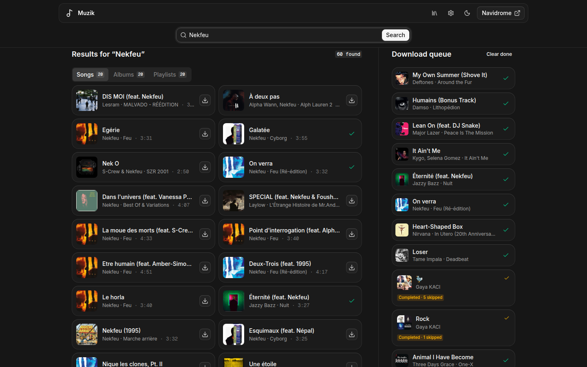
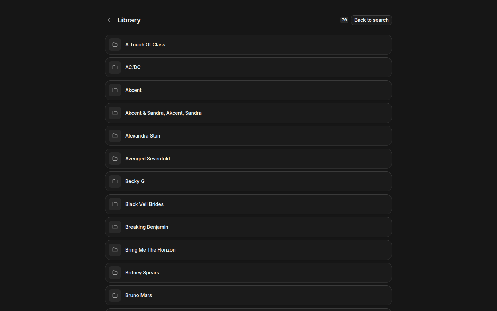

<p align="center">
  
</p>

<h1 align="center">Muzik</h1>

<p align="center">
   <strong>A YouTube Music search and download front end for your own music library.</strong><br>
   <em>Search or paste a link, queue the download, and the tracks land tagged on disk.</em>
</p>

<p align="center">
  <a href="https://nextjs.org"></a>
  <a href="https://nodejs.org"></a>
  <a href="https://tailwindcss.com"></a>
  <a href="https://www.docker.com"></a>
  <a href="https://github.com/kacigaya/muzik/blob/main/LICENSE"></a>
</p>

<p align="center">
  <a href="https://kacigaya.github.io/muzik/"><strong>Documentation</strong></a>
</p>

Muzik writes into a directory you choose, in an `Artist/Album/Track` layout that Navidrome,
Jellyfin, Plex, or a plain file browser can read. It has no accounts and no database.

## Screenshots

### Search and download queue



### Library browser



## Features

- Search songs, albums, and playlists from YouTube Music, or paste a YouTube, YouTube Music, SoundCloud, or Bandcamp link
- Expand an album or playlist and queue only the tracks you want
- Follow a collection and Muzik re-checks it on a schedule, downloading whatever was added since
- Serial queue with live progress, speed, and time remaining, persisted to disk and recovered after a restart
- Pick m4a, opus, mp3, or transcoded FLAC
- Album artist, album year, and one broad MusicBrainz genre normalized from the files themselves
- Synced lyrics written next to each track as `.lrc`, on by default and switchable in settings
- Optional Navidrome links and a scan trigger after each download
- Optional Lidarr registration with file recognition feedback and manual retry
- Optional routing of all downloads through a VPN container
- Installable as a PWA, with `/` and `⌘K` shortcuts and light and dark themes

## Quick start

With Docker:

```bash
docker build -t muzik .
docker run -d --name muzik \
  -p 3020:3020 \
  -v /path/to/your/music:/music \
  -v muzik-data:/data \
  muzik
```

From source, with Node.js 22+, Python 3.12+, and ffmpeg on `PATH`:

```bash
npm install
python3 -m venv .venv && .venv/bin/pip install -r requirements.txt
npm run dev
```

Muzik asks for a music folder the first time you open it. Set `MUZIK_MUSIC_DIR` to skip
that screen.

**Muzik has no authentication.** Bind it to a private interface or put it behind whatever
front end you already use. See [Deploy](https://kacigaya.github.io/muzik/docs/getting-started/deploy/).

## Documentation

Full documentation lives at **<https://kacigaya.github.io/muzik/>**.

- [Install](https://kacigaya.github.io/muzik/docs/getting-started/install/)
- [Deploy](https://kacigaya.github.io/muzik/docs/getting-started/deploy/)
- [Downloads](https://kacigaya.github.io/muzik/docs/guide/downloads/)
- [Audio formats](https://kacigaya.github.io/muzik/docs/guide/audio-formats/)
- [Configuration](https://kacigaya.github.io/muzik/docs/reference/configuration/)
- [Security](https://kacigaya.github.io/muzik/docs/reference/security/)

The site source is in [`web/`](web).

### Lidarr

Enable Lidarr in Muzik's Settings and enter its server URL and API key from
Lidarr **Settings > General**. Use **Test connection** before saving. Both apps must
have access to the same music files, within a root folder configured in Lidarr.
If Muzik sees the shared folder as `/music` and Lidarr sees it as `/media/music`,
set **Music root inside Lidarr** to `/media/music`; otherwise leave it blank.

Muzik scans finished songs, albums, and playlists in place, adds no new artists,
and reports how many files Lidarr matched. Add artists in Lidarr first. Singles,
playlist collections, incomplete albums, and releases Lidarr cannot identify may
remain unmatched. Lidarr can update tags according to its own settings.

Lidarr errors leave downloads successful. **Retry Lidarr** repeats registration
without downloading again. Existing downloads from before this feature have no
saved file paths and are not registered automatically. Environment overrides are
listed in the [configuration reference](https://kacigaya.github.io/muzik/docs/reference/configuration/).

## Development

```bash
npm test         # node --test plus the Python unittest suite
npm run lint
npm run typecheck
npm run build
node scripts/audit_dependencies.mjs
```

GitHub Actions runs all four on every push and pull request, plus `npm audit` and a build
of the Docker image. See
[Development](https://kacigaya.github.io/muzik/docs/reference/development/) for the project
structure.

The audit gate rejects high and critical findings. Until November 7, 2026 UTC, it reports
but excepts [GHSA-vfj7-8cjw-p6xm](https://github.com/advisories/GHSA-vfj7-8cjw-p6xm)
only for dev-only `braces@3.0.3` and its dependent findings. Next.js lint tooling requires
it and no patched release is available. Other advisories, production copies, changed
versions, audit failures, and expiry still fail CI. Remove the exception when upstream
provides a fix.

## Notes

Normal downloads talk to public, anonymous YouTube Music. There is no YouTube login or
cookie jar. Use every source only for content you are allowed to save.

### Album artwork

After downloads, Muzik crops embedded YouTube artwork with solid sidebars to a square
and writes it to `cover.jpg` and back into each audio file. Audio streams are copied
without re-encoding. Navidrome serves embedded artwork for per-track cover requests,
which many Subsonic clients use, so both copies matter. Existing `cover.*`, `folder.*`,
and `front.*` artwork takes priority and is preserved. Square images and landscape
images without solid sidebars are left alone.

Repair existing albums with `node --experimental-strip-types scripts/fix_artwork.mjs`
(using the configured music folder or `MUZIK_MUSIC_DIR`), then rescan the library in
Navidrome. Clients may need to refresh their cached album images.

## License

MIT
